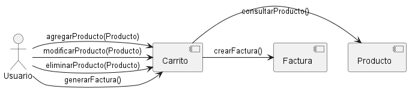

### 2. Diagrama de Colaboración
```js
@startuml
actor Usuario
component Carrito
component Producto
component Factura

Usuario -> Carrito : agregarProducto(Producto)
Carrito -> Producto : consultarProducto()
Usuario -> Carrito : modificarProducto(Producto)
Usuario -> Carrito : eliminarProducto(Producto)
Usuario -> Carrito : generarFactura()
Carrito -> Factura : crearFactura()

@enduml
```
Explicación: El diagrama de colaboración muestra las interacciones entre los objetos y actores para lograr un objetivo específico. En este caso, describe cómo el Usuario interactúa con Carrito, Producto y Factura para gestionar productos en el carrito y generar una factura. Este diagrama es útil para visualizar las colaboraciones entre objetos.
