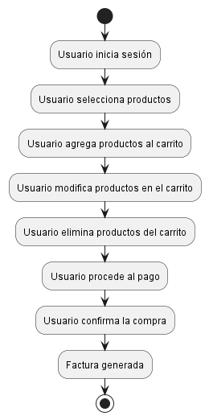

## Diagramas Comportamentales

### 3. Diagrama de Actividad
```js
@startuml
start
:Usuario inicia sesión;
:Usuario selecciona productos;
:Usuario agrega productos al carrito;
:Usuario modifica productos en el carrito;
:Usuario elimina productos del carrito;
:Usuario procede al pago;
:Usuario confirma la compra;
:Factura generada;
stop
@enduml
```
- **Explicación:** El diagrama de actividad muestra el flujo de trabajo del Usuario desde el inicio de sesión hasta la generación de la factura. Cada actividad representa un paso en el proceso de compra. Este diagrama es útil para entender el flujo de procesos y actividades en el sistema.

