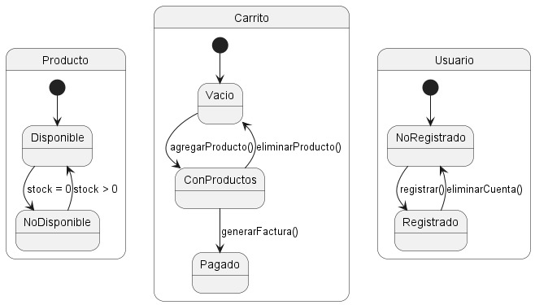

## Diagramas Comportamentales

### 4. Diagrama de Estado-Transición
```js
@startuml
state "Producto" as P {
  [*] --> Disponible
  Disponible --> NoDisponible : stock = 0
  NoDisponible --> Disponible : stock > 0
}

state "Carrito" as C {
  [*] --> Vacio
  Vacio --> ConProductos : agregarProducto()
  ConProductos --> Vacio : eliminarProducto()
  ConProductos --> Pagado : generarFactura()
}

state "Usuario" as U {
  [*] --> NoRegistrado
  NoRegistrado --> Registrado : registrar()
  Registrado --> NoRegistrado : eliminarCuenta()
}
@enduml
```

- **Explicación:** El diagrama de estado-transición muestra los estados posibles de los objetos Producto, Carrito y Usuario, así como las transiciones entre estos estados. Este diagrama es útil para visualizar los estados y cambios en el ciclo de vida de los objetos en el sistema.

