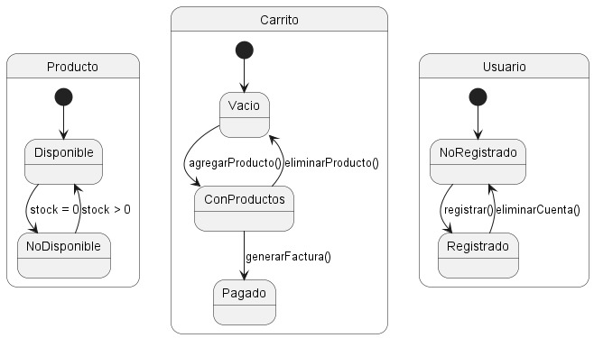

## Diagramas Comportamentales

### 5. Diagrama de Caso de Uso
```js
@startuml
actor Usuario
actor Administrador

usecase "Registrar Usuario" as RU
usecase "Iniciar Sesión" as IS
usecase "Agregar Producto al Carrito" as AP
usecase "Modificar Producto en el Carrito" as MP
usecase "Eliminar Producto del Carrito" as EP
usecase "Generar Factura" as GF
usecase "Gestionar Usuarios" as GU
usecase "Gestionar Productos" as GP

Usuario -> RU
Usuario -> IS
Usuario -> AP
Usuario -> MP
Usuario -> EP
Usuario -> GF
Administrador -> GU
Administrador -> GP
@enduml
```

- **Explicación:** El diagrama de caso de uso muestra las interacciones entre los actores Usuario y Administrador y los casos de uso del sistema, como registrar usuario, iniciar sesión, agregar producto al carrito, modificar producto en el carrito, eliminar producto del carrito, generar factura, gestionar usuarios y gestionar productos. Este diagrama es útil para entender las funcionalidades del sistema desde la perspectiva del usuario y el administrador.

