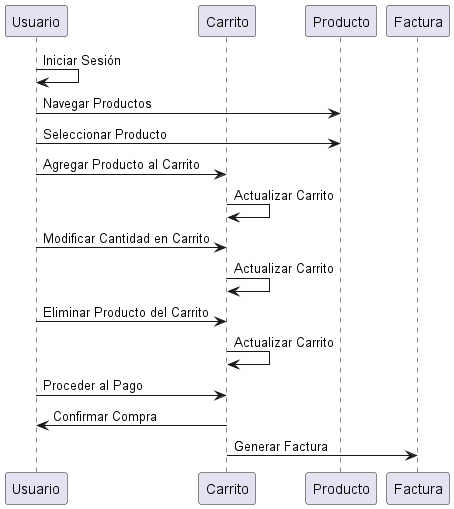

## Diagramas Comportamentales

### 6. Diagrama de Tiempo (Timing)
```js
@startuml
participant "Usuario" as U
participant "Carrito" as C
participant "Producto" as P
participant "Factura" as F

U -> U : Iniciar Sesión
U -> P : Navegar Productos
U -> P : Seleccionar Producto
U -> C : Agregar Producto al Carrito
C -> C : Actualizar Carrito

U -> C : Modificar Cantidad en Carrito
C -> C : Actualizar Carrito

U -> C : Eliminar Producto del Carrito
C -> C : Actualizar Carrito

U -> C : Proceder al Pago
C -> U : Confirmar Compra
C -> F : Generar Factura

@enduml
```

- **Explicación:** El diagrama de tiempo muestra cómo el estado de los objetos Usuario, Carrito, Producto y Factura cambia a lo largo del tiempo. Este diagrama es útil para visualizar los cambios en el estado de los objetos y los eventos a lo largo de una línea de tiempo.

