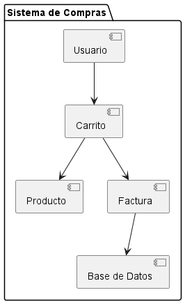

## Diagramas Estructurales

### 3. Diagrama de Componentes
```js
@startuml
package "Sistema de Compras" {
  [Usuario] --> [Carrito]
  [Carrito] --> [Producto]
  [Carrito] --> [Factura]
  [Factura] --> [Base de Datos]
}
@enduml
```
- **Explicación:** El diagrama de componentes muestra los componentes principales del sistema y sus relaciones. En este caso, Usuario interactúa con Carrito, Carrito interactúa con Producto y Factura, y Factura se comunica con la base de datos. Este diagrama es útil para entender la arquitectura del sistema y cómo se dividen las responsabilidades entre los componentes.
