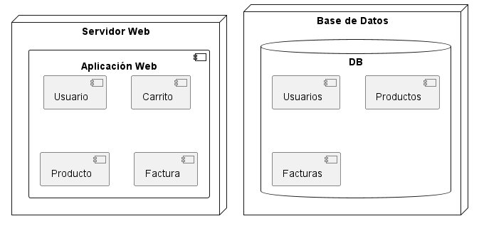

## Diagramas Estructurales

### 4. Diagrama de Despliegue (Deployment)
```js
@startuml
node "Servidor Web" {
  component "Aplicación Web" {
    [Usuario]
    [Carrito]
    [Producto]
    [Factura]
  }
}

node "Base de Datos" {
  database "DB" {
    [Usuarios]
    [Productos]
    [Facturas]
  }
}
@enduml
```

- **Explicación:** El diagrama de despliegue muestra la distribución física del sistema en diferentes nodos. Aquí, la aplicación web, que incluye Usuario, Carrito, Producto y Factura, se despliega en un servidor web, mientras que los datos se almacenan en una base de datos. Este diagrama es útil para visualizar cómo se despliega el sistema en el hardware.

