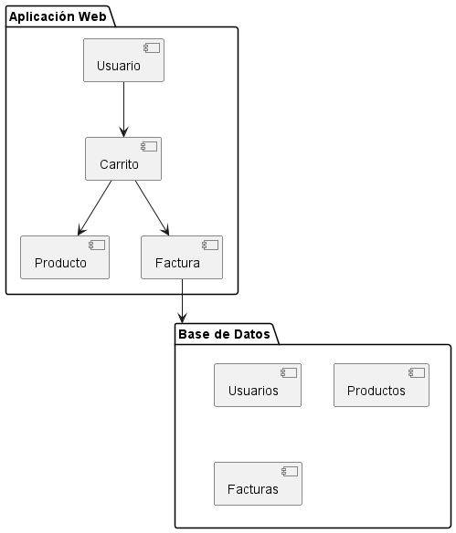

## Diagramas Estructurales

### 5. Diagrama de Paquetes
```js
@startuml
package "Aplicación Web" {
  [Usuario]
  [Carrito]
  [Producto]
  [Factura]
}

package "Base de Datos" {
  [Usuarios]
  [Productos]
  [Facturas]
}

[Usuario] --> [Carrito]
[Carrito] --> [Producto]
[Carrito] --> [Factura]
[Factura] --> [Base de Datos]
@enduml
```

- **Explicación:** El diagrama de paquetes organiza las clases en paquetes para mostrar la estructura del sistema a nivel de módulos. Aquí, Usuario, Carrito, Producto y Factura están en el paquete de la aplicación web, mientras que Usuarios, Productos y Facturas están en el paquete de la base de datos. Este diagrama es útil para entender la modularidad y las dependencias entre diferentes partes del sistema.


