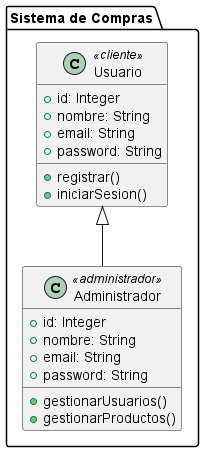

## Diagramas Estructurales

### 6. Diagrama de Perfil
```js
@startuml
package "Sistema de Compras" {
  
  class Usuario <<cliente>> {
    +id: Integer
    +nombre: String
    +email: String
    +password: String
    +registrar()
    +iniciarSesion()
  }

  class Administrador <<administrador>> {
    +id: Integer
    +nombre: String
    +email: String
    +password: String
    +gestionarUsuarios()
    +gestionarProductos()
  }
}
Usuario <|-- Administrador
@enduml

```
- **Explicación:** El diagrama de perfil utiliza estereotipos para extender UML y crear perfiles personalizados. Aquí, se definen dos estereotipos: cliente y administrador, aplicados a las clases Usuario y Administrador respectivamente. Este diagrama es útil para personalizar UML y adaptar el modelo a necesidades específicas, mostrando roles diferentes dentro del sistema.

