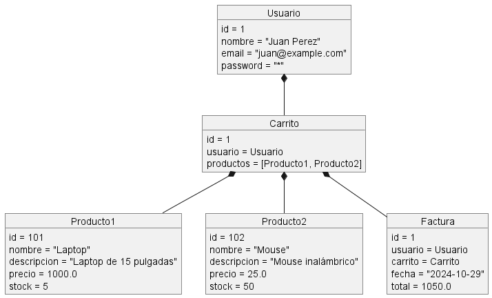

## Diagramas Estructurales

### 2. Diagrama de Objetos
```js
@startuml
object Usuario {
  id = 1
  nombre = "Juan Perez"
  email = "juan@example.com"
  password = "*"
}

object Producto1 {
  id = 101
  nombre = "Laptop"
  descripcion = "Laptop de 15 pulgadas"
  precio = 1000.0
  stock = 5
}

object Producto2 {
  id = 102
  nombre = "Mouse"
  descripcion = "Mouse inalámbrico"
  precio = 25.0
  stock = 50
}

object Carrito {
  id = 1
  usuario = Usuario
  productos = [Producto1, Producto2]
}

object Factura {
  id = 1
  usuario = Usuario
  carrito = Carrito
  fecha = "2024-10-29"
  total = 1050.0
}

Usuario *-- Carrito
Carrito *-- Producto1
Carrito *-- Producto2
Carrito *-- Factura
@enduml
```
- **Explicación:** El diagrama de objetos muestra instancias específicas de las clases Usuario, Producto, Carrito y Factura. Aquí, el carrito contiene dos productos: una laptop y un mouse, y el usuario tiene una factura generada para este carrito. Este diagrama es útil para visualizar el estado del sistema en un momento específico.

