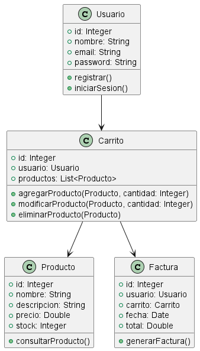

## Diagramas Estructurales

### 1. Diagrama de Clases
```js
@startuml
class Usuario {
  +id: Integer
  +nombre: String
  +email: String
  +password: String
  +registrar()
  +iniciarSesion()
}

class Producto {
  +id: Integer
  +nombre: String
  +descripcion: String
  +precio: Double
  +stock: Integer
  +consultarProducto()
}

class Carrito {
  +id: Integer
  +usuario: Usuario
  +productos: List<Producto>
  +agregarProducto(Producto, cantidad: Integer)
  +modificarProducto(Producto, cantidad: Integer)
  +eliminarProducto(Producto)
}

class Factura {
  +id: Integer
  +usuario: Usuario
  +carrito: Carrito
  +fecha: Date
  +total: Double
  +generarFactura()
}

Usuario --> Carrito
Carrito --> Producto
Carrito --> Factura
@enduml
```

- **Explicación:** El diagrama de clases muestra la estructura de las clases Usuario, Producto, Carrito y Factura, incluyendo sus atributos y métodos. Las relaciones indican que un Usuario puede tener un Carrito, que un Carrito puede contener múltiples Productos, y que una Factura está relacionada con un Carrito y un Usuario. Este diagrama es útil para entender la estructura del sistema y cómo interactúan las diferentes clases.

